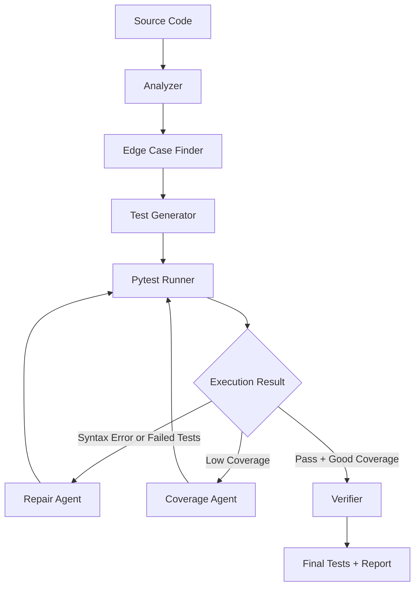

# TestFlow

**Execution-Guided Unit Test Orchestrator for Python**

Track 2: Engineering Depth

TestFlow generates unit tests, runs them with pytest, observes real execution feedback, repairs failures from traceback output, measures coverage, and generates additional tests when coverage or behavior coverage is low. The goal is not to wrap an LLM call. The goal is to build a runtime system where execution results control the next step.

## Why TestFlow?

Most tools do:

```text
Code -> LLM -> Tests
```

TestFlow does:

```text
Generate -> Run -> Observe -> Repair -> Measure Coverage -> Generate More
```

One-shot unit test generation often breaks in ordinary engineering cases:

- generated tests fail at runtime
- imports or module paths are wrong
- assertions are too weak to catch regressions
- exception paths and edge cases are missed
- line coverage is low, but the generator has no feedback loop

TestFlow closes that loop with pytest execution, traceback-guided repair, coverage-guided test generation, and a final execution report.

## Core Technical Idea

TestFlow treats unit test generation as **state-based orchestration** and **execution-guided search**.

The orchestrator keeps runtime state:

- source code
- generated tests
- pytest result
- traceback
- pass rate
- coverage
- actions taken

It then chooses actions dynamically:

- analyze
- generate tests
- run tests
- repair failed tests
- generate edge cases
- expand coverage
- verify
- stop

Objective:

```text
score = pass_rate + alpha * coverage - beta * cost
```

This score is not a claim that coverage proves correctness. It is a practical signal for deciding whether the test suite should be repaired, expanded, verified, or finalized.

## Architecture



The important loop is `Pytest Runner -> Execution Result -> Repair/Coverage -> Pytest Runner`. Runtime feedback controls the workflow through dynamic next-action selection.

## Runtime State Example

```json
{
  "target_file": "examples/calculator.py",
  "pass_rate": 1.0,
  "coverage": 0.84,
  "syntax_error": false,
  "actions_taken": [
    "analyze",
    "generate_tests",
    "run_tests",
    "repair_failed_tests",
    "measure_coverage",
    "generate_missing_tests"
  ]
}
```

## How It Works

**Analyzer**

Input: target Python file.

Output: functions, classes, imports, signatures, and visible exception paths.

**Edge Case Finder**

Input: analyzer output and source code.

Output: likely invalid inputs, boundaries, branch cases, and exception scenarios.

**Test Generator**

Input: source code, structured analysis, and edge cases.

Output: pytest test code written to `generated_tests/`.

**Pytest Runner**

Input: generated test file.

Output: pytest stdout, stderr, return code, pass rate, and traceback. This is the runtime checkpoint that makes the system more than one-shot generation.

**Repair Agent**

Input: current test code, pytest output, stderr, and traceback.

Output: repaired pytest test code. This step targets syntax errors, bad imports, wrong assumptions, and missing pytest usage.

**Coverage Agent**

Input: current tests, target source, and measured coverage.

Output: expanded tests for uncovered branches, boundaries, and exception paths.

**Verifier**

Input: final test code and execution metrics.

Output: checks for duplicate tests, missing assertions, weak assertions, and risky patterns.

**Final Report**

Input: final runtime state.

Output: target file, functions found, actions taken, final pass rate, coverage, and generated test path.

## Installation

```bash
# Windows
powershell -NoProfile -ExecutionPolicy Bypass -File ./init.ps1

# Bash
./init.sh
```

## Usage

```bash
python main.py --target examples/calculator.py
```

## Real Agent and Langfuse Setup

Create local secrets in `.env`:

```bash
OPENAI_API_KEY=sk-...
OPENAI_MODEL=gpt-4o-mini
LANGFUSE_PUBLIC_KEY=pk-lf-...
LANGFUSE_SECRET_KEY=sk-lf-...
LANGFUSE_HOST=https://cloud.langfuse.com
LANGFUSE_CAPTURE_IO=false
```

`.env` is ignored by git. Keep `LANGFUSE_CAPTURE_IO=false` unless you are comfortable sending source prompts and generated tests to Langfuse.

Run the merged agent layer directly:

```bash
.\.venv\Scripts\python.exe scripts\run_agent_smoke.py --target examples\calculator.py
```

With real OpenAI and Langfuse keys, `TestGeneratorAgent` calls the model and the LLM call is traced in Langfuse. Without keys, the same command uses deterministic fallback behavior.

## Easy Real Flow

Use these folders for local real-agent testing:

```text
test_data/        # Python target files to test
generated_tests/  # pytest files generated by TestFlow
.testflow/        # coverage XML, HTML coverage, final artifacts
```

Put one or more `.py` files into `test_data/`, then run:

```powershell
.\.venv\Scripts\python.exe scripts\run_real_flow.py
```

Run one specific file:

```powershell
.\.venv\Scripts\python.exe scripts\run_real_flow.py --target examples\string_utils.py
```

The command generates tests, runs them, prints coverage, writes XML/HTML reports, flushes Langfuse traces, and prints the newest Langfuse trace URL when credentials are configured.

In Langfuse, open the printed trace URL or filter by trace name `testflow-real-flow`. The tree shows the full flow: analyze target, find edge cases, generate tests, run generated tests, measure coverage, and write coverage artifacts. The LLM generation observation is nested under `generate-tests`.

## Example Output

```text
========== TestFlow Report ==========
Target: examples/calculator.py
Generated test file: generated_tests/test_calculator.py
Actions:
- analyze
- generate_tests
- run_tests
- measure_coverage
- generate_missing_tests
Final pass rate: 100%
Final coverage: 100%
Status: completed
====================================
```

## Project Structure

```text
testflow/
  agents/
  orchestrator.py
  runner.py
  state.py
examples/
generated_tests/
docs/
main.py
requirements.txt
README.md
```

## Why This Fits Engineering Depth

TestFlow is not a chatbot, not one-shot test generation, and not a fixed static pipeline. It is a runtime feedback system:

- executes generated tests with pytest
- observes concrete failures from stdout, stderr, return code, and traceback
- repairs generated tests using traceback-guided repair
- expands tests using coverage-guided test generation
- uses state-based orchestration for dynamic next-action selection
- emits a final execution report that shows what the system actually did

The deeper direction is learned planning or reward-guided test search, where the planner can optimize pass rate, coverage, assertion quality, historical defect discovery, and execution cost.

## Engineering Tradeoffs

- The MVP uses a heuristic planner so the loop is easy to inspect during a 3-hour hackathon.
- A future version can use an LLM planner, but the runtime feedback contract should stay explicit.
- Coverage is useful for finding missed code paths, but it does not guarantee correctness.
- Generated tests still need human review before production use.
- Sandboxing is needed before running generated tests against untrusted code.
- The first version focuses on Python, pytest, and line coverage before adding broader language support.

## Roadmap

- MVP: Python + pytest + coverage
- LLM-based planner
- mutation testing
- GitHub Actions integration
- PR comment bot
- JavaScript/TypeScript support
- learned planner from execution traces
- reward model for test quality

## Vietnam Impact

Vietnam has many software outsourcing and product engineering teams maintaining large codebases. TestFlow can help improve unit test coverage, reduce manual QA burden, and train junior developers through concrete generated test examples.

## License

- Create CLI.
- Load target project.
- Analyze Python files with AST.
- Generate initial tests with LLM.
- Write tests to disk.
- Run pytest.
- Capture stdout/stderr/exit code.

### Phase 2 — Execution Feedback

- Parse pytest failure output.
- Detect syntax/import/assertion errors.
- Add Repair Agent.
- Rerun after repair.

### Phase 3 — Coverage-Guided Generation

- Run pytest with coverage.
- Parse `coverage.xml`.
- Map missing lines to functions.
- Ask Generator for targeted tests.

### Phase 4 — Verifier

- Detect weak assertions.
- Detect duplicated tests.
- Detect flaky patterns.
- Ask Generator/Repair Agent to improve tests.

### Phase 5 — Report

Generate a final report:

```markdown
# TestFlow Report

- Target project: examples/calculator
- Pass rate: 100%
- Line coverage: 88%
- Generated tests: 16
- Repaired tests: 3
- Duplicate tests removed: 1
- Weak assertions improved: 2

## Files generated
- tests/test_calculator_generated.py

## Missing coverage remaining
- src/calculator.py: lines 72-74

## Planner trace
1. Analyze
2. GenerateTests
3. RunTests
4. RepairTests
5. RunTests
6. MeasureCoverage
7. FindEdgeCases
8. GenerateTests
9. VerifyTests
10. Stop
```

---

## 13. Example: State Transition

Initial state:

```json
{
  "pass_rate": 0.0,
  "coverage": 0.0,
  "tests_generated": 0
}
```

After generation:

```json
{
  "tests_generated": 10,
  "status": "ready_to_execute"
}
```

After first run:

```json
{
  "pass_rate": 0.8,
  "coverage": 0.52,
  "failed_tests": 2,
  "error_types": ["ImportError", "AssertionError"]
}
```

Planner decision:

```json
{
  "next_agent": "RepairAgent",
  "reason": "Pass rate is below 100%; repair failures before generating more tests."
}
```

After repair:

```json
{
  "pass_rate": 1.0,
  "coverage": 0.52,
  "failed_tests": 0
}
```

Planner decision:

```json
{
  "next_agent": "CoverageAgent",
  "reason": "Tests pass but coverage is below target."
}
```

Final:

```json
{
  "pass_rate": 1.0,
  "coverage": 0.88,
  "assertion_quality": 0.81,
  "stop": true
}
```

---

## 14. Evaluation Metrics

TestFlow reports multiple metrics instead of only “tests generated”.

### Execution metrics

- Pass rate.
- Number of failed tests.
- Number of repaired tests.
- Number of reruns.

### Coverage metrics

- Line coverage.
- Branch coverage.
- Missing lines.
- Newly covered symbols.

### Quality metrics

- Assertion quality score.
- Duplicate test count.
- Flaky risk.
- Mutation score, if available.

### Cost metrics

- Number of LLM calls.
- Tokens used.
- Runtime.
- Iterations used.

---

## 15. Why This Can Become a Product

### First customer

Vietnamese software outsourcing teams and product teams that maintain Python/Backend codebases and need better unit test coverage before release, handover, or refactoring.

### First use case

A developer runs TestFlow on a legacy module:

```bash
testflow run ./src/billing --target-coverage 80
```

The system generates tests, executes them, repairs failures, increases coverage, and produces a report that can be attached to a pull request.

### Expansion path

1. CLI for individual developers.
2. GitHub Action for pull requests.
3. Team dashboard for coverage gaps and generated test history.
4. Enterprise integration for monorepos.
5. Learned planner trained from execution traces.
6. Reward model for unit test quality.

### Why this is not a generic AI wrapper

The product value comes from execution and feedback loops:

- It runs tests.
- It reads failures.
- It measures coverage.
- It detects weak assertions.
- It changes the next action based on runtime state.

The LLM is not the product. The orchestration loop is the product.

---

## 16. Impact for Vietnam

Vietnam has many software outsourcing teams, junior developers, and fast-moving product teams. A common problem is that teams ship quickly but lack time to build strong automated tests.

TestFlow can help by:

- Raising unit testing standards in Vietnamese engineering teams.
- Reducing QA and maintenance cost for outsourcing projects.
- Helping junior developers learn what good tests look like.
- Making code handover more reliable.
- Improving confidence when refactoring legacy systems.
- Making Vietnamese software teams more competitive globally.

The Vietnam-specific angle is not “AI helps everyone”. The angle is:

> Vietnam’s software industry can move up the value chain by improving engineering quality, test reliability, and delivery confidence.

---

## 17. Hackathon Pitch

### One-liner

> TestFlow is an execution-guided unit test orchestrator that generates, runs, repairs, verifies, and improves tests using runtime feedback.

### 30-second pitch

Most AI unit test tools do `code → LLM → test`. That fails on real projects because good tests require iteration: understand the API, find edge cases, run tests, repair failures, measure coverage, and verify assertions. TestFlow turns unit test generation into a runtime-orchestrated search problem. It uses agents for analysis, generation, execution, repair, coverage, and verification, but the key is that the graph changes based on actual execution results. If tests fail, it repairs. If coverage is low, it targets missing lines. If assertions are weak, it verifies and regenerates. The result is not just more tests, but tests that run, cover real behavior, and are easier to trust.

### Demo script

1. Show a small Python project with low/no tests.
2. Run:

```bash
python main.py --target examples/calculator.py --coverage-target 0.85
```

3. Show generated tests.
4. Show first pytest failure.
5. Show Repair Agent fixing it.
6. Show coverage improving after targeted edge-case generation.
7. Show final report.

### Judge-facing points

- **Does it work?** It runs real pytest commands and produces real generated tests.
- **Engineering depth:** The orchestration is stateful, execution-guided, and search-based.
- **Market scale:** First customer is software teams needing automated test coverage for real codebases.
- **Vietnam impact:** Helps Vietnamese engineering teams improve quality, delivery confidence, and global competitiveness.
- **Codex/OpenAI fit:** Codex-style agents can inspect code, modify tests, run commands, and iterate from execution feedback.

---

## 18. Future Research Direction

TestFlow can evolve from heuristic orchestration into a learned system.

### Learned planner

Collect traces:

```json
{
  "state": {...},
  "action": "CoverageAgent",
  "new_state": {...},
  "reward": 0.18
}
```

Train a planner to choose actions that maximize test quality per cost.

### Reward model

Train a reward model to score generated tests based on:

- Pass rate.
- Coverage gain.
- Mutation score.
- Assertion strength.
- Non-duplication.
- Stability.

### RL / GRPO direction

Use execution-derived rewards to improve planner or generator behavior:

```text
Reward = coverage_gain + mutation_gain + pass_bonus - cost_penalty - flaky_penalty
```

This connects naturally to work on SFT, reward modeling, GRPO, Open-R1, and code evaluation.

---

## 19. Risks and Limitations

### Generated tests may encode wrong behavior

Mitigation:

- Verifier Agent checks oracle quality.
- Prefer behavior from docstrings and public API.
- Surface uncertain tests in the report.

### Coverage can be gamed

High coverage does not always mean good tests.

Mitigation:

- Add assertion quality checks.
- Add mutation testing.
- Penalize duplicate or shallow tests.

### Repair Agent may hide real bugs

A failing test may reveal a production bug, not a bad test.

Mitigation:

- Repair Agent only edits generated tests.
- Report suspicious failures separately.
- Never silently modify production code.

### Cost can grow with iterations

Mitigation:

- Use max iteration budget.
- Cache analysis results.
- Stop once marginal improvement is low.

---

## 20. Development Commands

Bootstrap the local virtual environment and run the standard checks:

```bash
# Windows
powershell -NoProfile -ExecutionPolicy Bypass -File ./init.ps1

# Bash
./init.sh
```

All project Python commands should run through `.venv`. Use global Python only to create `.venv`.

Install dependencies manually when needed:

```bash
# Windows
.\.venv\Scripts\python.exe -m pip install -r requirements.txt
.\.venv\Scripts\python.exe -m pip install -e .

# Bash
.venv/bin/python -m pip install -r requirements.txt
.venv/bin/python -m pip install -e .
```

Run TestFlow:

```bash
# Windows
.\.venv\Scripts\python.exe main.py --target examples\calculator.py --coverage-target 0.85

# Bash
.venv/bin/python main.py --target examples/calculator.py --coverage-target 0.85
```

Run internal tests:

```bash
# Windows
.\.venv\Scripts\python.exe -m pytest tests/

# Bash
.venv/bin/python -m pytest tests/
```

Generate coverage:

```bash
# Windows
.\.venv\Scripts\python.exe -m pytest --cov=src --cov-report=xml --cov-report=term-missing

# Bash
.venv/bin/python -m pytest --cov=src --cov-report=xml --cov-report=term-missing
```

---

## 21. Minimal Environment Variables

```bash
export OPENAI_API_KEY="your_api_key"
export TESTFLOW_MODEL="gpt-4.1"
```

Optional:

```bash
export TESTFLOW_MAX_ITERATIONS=8
export TESTFLOW_TARGET_COVERAGE=0.85
```

---

## 22. Sample Final Report

```markdown
# TestFlow Report

## Summary

| Metric | Value |
|---|---:|
| Pass rate | 100% |
| Line coverage | 88% |
| Branch coverage | 76% |
| Generated tests | 16 |
| Repaired tests | 3 |
| Weak assertions fixed | 2 |
| Duplicate tests removed | 1 |
| Iterations | 6 |

## Generated files

- tests/test_calculator_generated.py

## Planner trace

1. AnalyzerAgent → discovered 6 functions and 2 exception paths.
2. TestGeneratorAgent → generated 10 initial tests.
3. RunnerAgent → 8 passed, 2 failed, 54% coverage.
4. RepairAgent → fixed import path and wrong exception assertion.
5. RunnerAgent → 10 passed, 0 failed, 54% coverage.
6. CoverageAgent → found missing error-handling branches.
7. EdgeCaseAgent → proposed divide-by-zero and invalid operator cases.
8. TestGeneratorAgent → generated 6 additional tests.
9. RunnerAgent → 16 passed, 0 failed, 88% coverage.
10. VerifierAgent → strengthened 2 assertions and removed 1 duplicate.

## Remaining gaps

- src/calculator.py lines 72-74 are not covered because they depend on external input.
```

---

## 23. License

MIT License.

---

## 24. Status

Prototype / hackathon MVP.

The current goal is to prove one thing clearly:

> Unit test generation becomes much stronger when the system is guided by real execution feedback instead of one-shot text generation.
MIT
