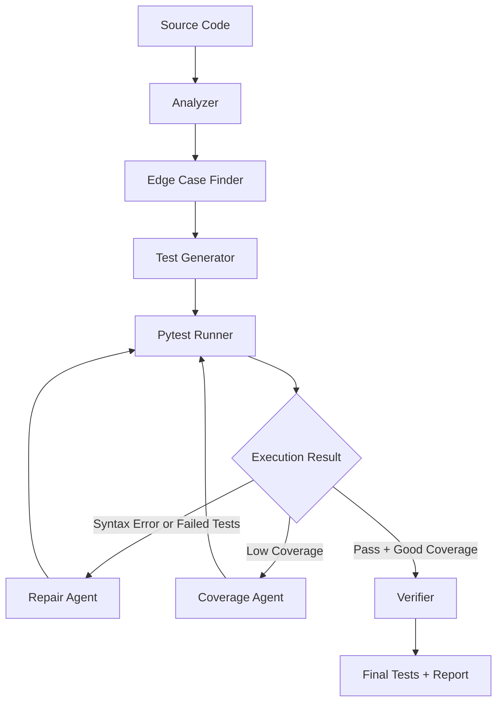

# TestFlow

**Execution-Guided Unit Test Orchestrator for Python**

Track 2: Engineering Depth

TestFlow generates unit tests, runs them with pytest, observes real execution feedback, repairs failures from traceback output, measures coverage, and generates additional tests when coverage or behavior coverage is low. The goal is not to wrap an LLM call. The goal is to build a runtime system where execution results control the next step.

## Why TestFlow?

Most tools do:

```text
Code -> LLM -> Tests
```

TestFlow does:

```text
Generate -> Run -> Observe -> Repair -> Measure Coverage -> Generate More
```

One-shot unit test generation often breaks in ordinary engineering cases:

- generated tests fail at runtime
- imports or module paths are wrong
- assertions are too weak to catch regressions
- exception paths and edge cases are missed
- line coverage is low, but the generator has no feedback loop

TestFlow closes that loop with pytest execution, traceback-guided repair, coverage-guided test generation, and a final execution report.

## Core Technical Idea

TestFlow treats unit test generation as **state-based orchestration** and **execution-guided search**.

The orchestrator keeps runtime state:

- source code
- generated tests
- pytest result
- traceback
- pass rate
- coverage
- actions taken

It then chooses actions dynamically:

- analyze
- generate tests
- run tests
- repair failed tests
- generate edge cases
- expand coverage
- verify
- stop

Objective:

```text
score = pass_rate + alpha * coverage - beta * cost
```

This score is not a claim that coverage proves correctness. It is a practical signal for deciding whether the test suite should be repaired, expanded, verified, or finalized.

## Architecture



The important loop is `Pytest Runner -> Execution Result -> Repair/Coverage -> Pytest Runner`. Runtime feedback controls the workflow through dynamic next-action selection.

## Runtime State Example

```json
{
  "target_file": "examples/calculator.py",
  "pass_rate": 1.0,
  "coverage": 0.84,
  "syntax_error": false,
  "actions_taken": [
    "analyze",
    "generate_tests",
    "run_tests",
    "repair_failed_tests",
    "measure_coverage",
    "generate_missing_tests"
  ]
}
```

## How It Works

**Analyzer**

Input: target Python file.

Output: functions, classes, imports, signatures, and visible exception paths.

**Edge Case Finder**

Input: analyzer output and source code.

Output: likely invalid inputs, boundaries, branch cases, and exception scenarios.

**Test Generator**

Input: source code, structured analysis, and edge cases.

Output: pytest test code written to `generated_tests/`.

**Pytest Runner**

Input: generated test file.

Output: pytest stdout, stderr, return code, pass rate, and traceback. This is the runtime checkpoint that makes the system more than one-shot generation.

**Repair Agent**

Input: current test code, pytest output, stderr, and traceback.

Output: repaired pytest test code. This step targets syntax errors, bad imports, wrong assumptions, and missing pytest usage.

**Coverage Agent**

Input: current tests, target source, and measured coverage.

Output: expanded tests for uncovered branches, boundaries, and exception paths.

**Verifier**

Input: final test code and execution metrics.

Output: checks for duplicate tests, missing assertions, weak assertions, and risky patterns.

**Final Report**

Input: final runtime state.

Output: target file, functions found, actions taken, final pass rate, coverage, and generated test path.

## Installation

```bash
pip install -r requirements.txt
```

## Usage

```bash
python main.py --target examples/calculator.py
```

## Example Output

```text
========== TestFlow Report ==========
Target: examples/calculator.py
Functions found: 5
Actions taken:
- analyze
- generate_tests
- run_tests
- repair_failed_tests
- measure_coverage
- generate_missing_tests
Final pass rate: 100%
Final coverage: 84%
Generated tests: generated_tests/test_calculator.py
====================================
```

## Project Structure

```text
testflow/
  agents/
  orchestrator.py
  runner.py
  state.py
examples/
generated_tests/
docs/
main.py
requirements.txt
README.md
```

## Why This Fits Engineering Depth

TestFlow is not a chatbot, not one-shot test generation, and not a fixed static pipeline. It is a runtime feedback system:

- executes generated tests with pytest
- observes concrete failures from stdout, stderr, return code, and traceback
- repairs generated tests using traceback-guided repair
- expands tests using coverage-guided test generation
- uses state-based orchestration for dynamic next-action selection
- emits a final execution report that shows what the system actually did

The deeper direction is learned planning or reward-guided test search, where the planner can optimize pass rate, coverage, assertion quality, historical defect discovery, and execution cost.

## Engineering Tradeoffs

- The MVP uses a heuristic planner so the loop is easy to inspect during a 3-hour hackathon.
- A future version can use an LLM planner, but the runtime feedback contract should stay explicit.
- Coverage is useful for finding missed code paths, but it does not guarantee correctness.
- Generated tests still need human review before production use.
- Sandboxing is needed before running generated tests against untrusted code.
- The first version focuses on Python, pytest, and line coverage before adding broader language support.

## Roadmap

- MVP: Python + pytest + coverage
- LLM-based planner
- mutation testing
- GitHub Actions integration
- PR comment bot
- JavaScript/TypeScript support
- learned planner from execution traces
- reward model for test quality

## Vietnam Impact

Vietnam has many software outsourcing and product engineering teams maintaining large codebases. TestFlow can help improve unit test coverage, reduce manual QA burden, and train junior developers through concrete generated test examples.

## License

MIT
