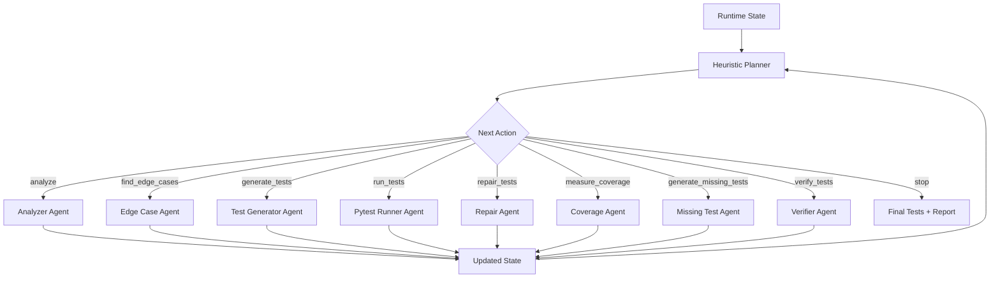

# TestFlow

**Execution-Guided Unit Test Orchestrator for Python**

Track 2: Engineering Depth

TestFlow takes a Python source file, analyzes its functions and edge cases, generates pytest tests, runs them, observes real execution feedback, repairs tests when failures or tracebacks occur, measures coverage, and generates additional tests when coverage is low. The output is not just generated code. It is an execution-validated test suite with pass rate, coverage, decision trace, and a final report.

The core engineering idea is **state-based orchestration**: each next action is selected from runtime state, not from a fixed sequential pipeline.

## User Pain Point

LLMs can generate unit tests, but one-shot tests often fail, miss edge cases, use weak or wrong assertions, and leave coverage gaps. Developers still have to manually run, debug, repair, and improve generated tests.

Most tools do:

```text
Code -> LLM -> Tests
```

TestFlow does:

```text
State -> Planner -> Action -> Agent -> Updated State -> Planner
```

In practical demo terms:

```text
Generate -> Run -> Observe -> Repair -> Measure Coverage -> Generate More
```

## Tech Stack

- Python
- pytest
- coverage.py
- OpenAI/Codex
- Langfuse tracing
- Streamlit UI

## Live App

App URL: https://testflow-uet.streamlit.app/

The Streamlit app provides a visual demo of the execution-guided loop.

- Demo Mode: deterministic and reliable for public judging
- Live Run: invokes the CLI when supported

Run locally:

```bash
streamlit run ui/app.py
```

CLI fallback:

```bash
python main.py --target examples/calculator.py
```

## Core Technical Idea

TestFlow treats unit test generation as an **execution-guided search problem**.

Runtime state includes:

- source code
- discovered functions, classes, imports, and exceptions
- generated tests
- pytest stdout/stderr and traceback
- pass rate
- coverage
- runtime flags such as syntax/import errors
- actions taken
- decision trace

Planner actions include:

- `analyze`
- `find_edge_cases`
- `generate_tests`
- `run_tests`
- `repair_tests`
- `measure_coverage`
- `generate_missing_tests`
- `verify_tests`
- `stop`

The planner chooses the next action from state:

- failing tests trigger repair
- syntax/import errors trigger repair
- passing tests trigger coverage measurement
- low coverage triggers missing-test generation
- good pass rate and coverage trigger verification/stop
- max iterations trigger stop

Objective:

```text
score = pass_rate + alpha * coverage - beta * cost
```

Coverage is useful for finding missed code paths, but it does not guarantee correctness.

## Architecture



The graph is not fixed. It changes based on pytest failures, traceback, pass rate, coverage, and iteration budget.

## Runtime State Example

```json
{
  "target_file": "examples/calculator.py",
  "test_file": "generated_tests/test_calculator.py",
  "pass_rate": 1.0,
  "coverage": 1.0,
  "coverage_threshold": 0.95,
  "total_tests": 37,
  "passed": 37,
  "failed": 0,
  "errors": 0,
  "status": "success",
  "actions_taken": [
    "analyze",
    "find_edge_cases",
    "generate_tests",
    "run_tests",
    "measure_coverage",
    "generate_missing_tests",
    "run_tests",
    "measure_coverage",
    "verify_tests"
  ]
}
```

## Example Decision Trace

```text
[0] initialized -> analyze
    reason: source code not loaded
[1] analyzed -> find_edge_cases
    reason: edge cases not discovered
[2] edge_cases_found -> generate_tests
    reason: no tests generated
[3] tests_generated -> run_tests
    reason: tests need execution
[4] tests_passed -> measure_coverage
    reason: tests pass but coverage not measured
[5] coverage_measured -> generate_missing_tests
    reason: coverage below threshold
[6] missing_tests_generated -> run_tests
    reason: tests need execution
[7] tests_passed -> measure_coverage
    reason: tests pass but coverage not measured
[8] coverage_measured -> verify_tests
    reason: pass rate and coverage target reached
```

This trace is the main proof that TestFlow is an orchestrator, not a fixed pipeline.

## How It Works

**Analyzer**

Input: target Python file.

Output: source code, functions, classes, imports, exceptions.

**Edge Case Agent**

Input: functions and signatures.

Output: edge-case hints such as zero denominator, negative input, empty string, invalid order, and boundary values.

**Test Generator Agent**

Input: source code, structured analysis, and edge cases.

Output: pytest test code written to `generated_tests/`.

**Pytest Runner Agent**

Input: generated test file.

Output: pytest stdout, stderr, return code, traceback, total tests, passed, failed, errors, and pass rate.

**Repair Agent**

Input: generated tests and execution failure information.

Output: repaired pytest file when syntax errors, import errors, or failing tests are detected.

**Coverage Agent**

Input: target source file and generated test file.

Output: measured coverage using coverage.py.

**Missing Test Agent**

Input: source code, generated tests, and coverage result.

Output: additional tests for uncovered branches, boundaries, and exception paths.

**Verifier Agent**

Input: final generated tests and execution metrics.

Output: static checks for assertions, weak tests, duplicate tests, and final success status.

**Final Report**

Input: final runtime state.

Output: generated test path, pass rate, coverage, pytest summary, actions taken, decision trace, and stop reason.

## Installation

```bash
# Windows
powershell -NoProfile -ExecutionPolicy Bypass -File ./init.ps1

# Bash
./init.sh
```

Manual install:

```bash
pip install -r requirements.txt
```

## Usage

```bash
python main.py --target examples/calculator.py --coverage-threshold 0.95 --max-iterations 12
```

Backward-compatible alias:

```bash
python main.py --target examples/calculator.py --coverage-target 0.95
```

## Example Output

```text
========== TestFlow Report ==========
TestFlow Runtime Summary
Target: examples/calculator.py
Generated test file: generated_tests/test_calculator.py

Decision trace:
[0] initialized -> analyze
    reason: source code not loaded
[1] analyzed -> find_edge_cases
    reason: edge cases not discovered
[2] edge_cases_found -> generate_tests
    reason: no tests generated
[3] tests_generated -> run_tests
    reason: tests need execution
[4] tests_passed -> measure_coverage
    reason: tests pass but coverage not measured
[5] coverage_measured -> generate_missing_tests
    reason: coverage below threshold
[6] missing_tests_generated -> run_tests
    reason: tests need execution
[7] tests_passed -> measure_coverage
    reason: tests pass but coverage not measured
[8] coverage_measured -> verify_tests
    reason: pass rate and coverage target reached

Final metrics:
Pass rate: 100%
Coverage: 100%
Pytest: 37 passed, 0 failed, 0 errors, 37 total
Functions discovered: 5
Iterations: 9/12
Status: success
Stop reason: verified successfully
====================================
```

## Langfuse Tracing

Create local secrets in `.env`:

```bash
OPENAI_API_KEY=sk-...
OPENAI_MODEL=gpt-4o-mini
LANGFUSE_PUBLIC_KEY=pk-lf-...
LANGFUSE_SECRET_KEY=sk-lf-...
LANGFUSE_HOST=https://cloud.langfuse.com
LANGFUSE_CAPTURE_IO=false
```

`.env` is ignored by git. Keep `LANGFUSE_CAPTURE_IO=false` unless you are comfortable sending prompt/source snippets and generated tests to Langfuse.

The CLI emits Langfuse runtime traces when Langfuse keys are configured. Look for:

```text
TestFlow Runtime Orchestrator
```

Expected spans:

```text
planner.choose_next_action
action.analyze
action.find_edge_cases
action.generate_tests
action.run_tests
action.measure_coverage
action.verify_tests
```

The direct agent smoke script can exercise the OpenAI-backed generator:

```bash
python scripts/run_agent_smoke.py --target examples/calculator.py
```

## Streamlit UI

```bash
streamlit run ui/app.py
```

The UI shows:

- target file selector
- Demo Mode and Live Run
- pass rate, coverage, iterations, repairs triggered
- execution timeline
- source code
- generated tests
- pytest output
- final summary JSON

## Project Structure

```text
testflow/
  orchestrator.py
  runner.py
  coverage_utils.py
  state.py
agents/
examples/
generated_tests/
docs/
tests/
ui/
main.py
requirements.txt
README.md
```

## Why This Fits Engineering Depth

TestFlow is not a chatbot, not one-shot generation, and not a generic multi-agent wrapper. It is a runtime feedback system:

- executes generated tests with pytest
- observes concrete stdout, stderr, return code, traceback, pass rate, and coverage
- selects the next action dynamically from runtime state
- repairs when tests fail
- expands tests when coverage is low
- emits a final execution report with decision trace
- stores final summary JSON for inspection

Planner unit tests in `tests/test_planner.py` prove that different states choose different actions.

## Engineering Tradeoffs

- The MVP uses a heuristic planner so judges can inspect the logic quickly.
- A future version can replace the heuristic planner with an LLM planner or learned policy.
- Coverage helps find missed code paths, but it does not prove semantic correctness.
- Generated tests still need human review before production use.
- Sandboxing is needed before running generated tests against untrusted code.
- The current demo focuses on Python, pytest, and line coverage.

## Roadmap

- MVP: Python + pytest + coverage
- stronger repair agent with traceback-specific patches
- mutation testing
- GitHub Actions integration
- PR comment bot
- JavaScript/TypeScript support
- learned planner from execution traces
- reward model for test quality

## Vietnam Impact

Vietnam has many software outsourcing and product engineering teams maintaining large codebases. TestFlow can help improve unit test coverage, reduce manual QA burden, and train junior developers through concrete generated test examples.

## License

MIT
