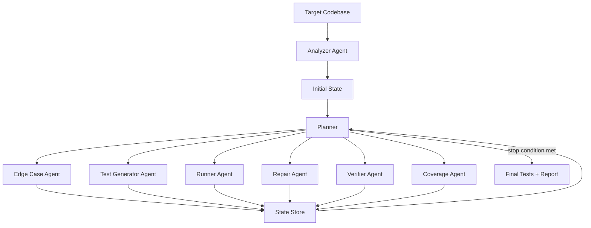

# TestFlow

> **Execution-Guided Unit Test Orchestrator** — hệ thống sinh unit test bằng cách chạy test thật, đọc lỗi thật, đo coverage thật, rồi tự quyết định bước tiếp theo.

TestFlow không cố gắng dùng một LLM để sinh toàn bộ unit test trong một lần. Thay vào đó, nó biến unit test generation thành một **bài toán tìm kiếm trên trạng thái thực thi**: phân tích code, sinh test, chạy test, sửa test lỗi, đo coverage, tìm edge case còn thiếu, verify chất lượng assertion, và lặp lại cho đến khi đạt mục tiêu.

```text
Codebase
   │
   ▼
Runtime Orchestrator
   │
   ├── Analyzer Agent
   ├── Edge Case Agent
   ├── Test Generator Agent
   ├── Runner Agent
   ├── Repair Agent
   ├── Coverage Agent
   └── Verifier Agent
   │
   ▼
High-quality unit tests + execution report
```

---

## 1. Problem

Các hệ thống sinh unit test phổ biến thường đi theo mô hình rất đơn giản:

```text
Source Code → LLM → Unit Test
```

Cách này hoạt động với ví dụ nhỏ, nhưng thường yếu khi gặp code thật:

- LLM hiểu sai API hoặc dependency.
- Test sinh ra có syntax error hoặc import sai.
- Test chạy được nhưng assertion hời hợt.
- Test chỉ cover happy path, bỏ sót edge case.
- Coverage thấp nhưng hệ thống không biết sinh thêm ở đâu.
- Test pass nhưng không kiểm tra đúng hành vi.
- Test bị duplicate, flaky, hoặc chỉ assert implementation detail.

Trong thực tế, sinh unit test tốt không phải một bước sinh text. Nó là một vòng lặp engineering:

```text
Understand API
 → Find edge cases
 → Generate tests
 → Run tests
 → Read failures
 → Repair tests
 → Measure coverage
 → Generate missing tests
 → Verify test quality
```

TestFlow được thiết kế cho chính vòng lặp này.

---

## 2. Core Idea

TestFlow là một **runtime-orchestrated multi-agent system** cho unit test generation.

Điểm khác biệt không nằm ở việc có nhiều agent. Điểm khác biệt là:

> Orchestrator được điều khiển bởi execution feedback.

Nghĩa là hệ thống không chạy pipeline cố định kiểu:

```text
Analyzer → Generator → Runner → Coverage
```

Thay vào đó, sau mỗi lần chạy test, TestFlow cập nhật trạng thái runtime:

```json
{
  "pass_rate": 0.72,
  "coverage": 0.48,
  "syntax_error": false,
  "import_error": true,
  "failed_tests": 3,
  "mutation_score": 0.41,
  "duplicated_tests": 2,
  "flaky_risk": "medium",
  "budget_used": 0.37
}
```

Sau đó Planner quyết định bước tiếp theo:

```json
{
  "next_agent": "RepairAgent",
  "reason": "Tests fail because generated imports do not match the project structure.",
  "expected_gain": "increase pass rate before generating more tests"
}
```

Vì vậy workflow có thể thay đổi theo runtime:

```text
Syntax Error        → Repair Agent
Import Error        → Analyzer Agent + Repair Agent
Low Coverage        → Coverage Agent + Edge Case Agent
Weak Assertions     → Verifier Agent
Duplicated Tests    → Verifier Agent + Test Generator Agent
All Metrics Good    → Stop
```

---

## 3. Why This Is Not Just “Multi-Agent”

Một hệ thống multi-agent thông thường chỉ chia nhỏ việc:

```text
Agent A does analysis
Agent B writes tests
Agent C runs tests
```

TestFlow xem unit test generation như một **search problem**:

```text
State  = current code understanding + generated tests + execution result + coverage + quality signals
Action = call an agent, repair tests, add edge cases, rerun tests, verify assertions
Transition = state changes after executing action
Goal = maximize useful test quality under cost budget
```

Objective:

```text
maximize:
  pass_rate
+ α * coverage
+ β * assertion_quality
+ γ * mutation_score
- δ * duplicated_tests
- λ * cost
```

This makes TestFlow an **execution-guided test search system**, not just an LLM wrapper.

---

## 4. Architecture



### Runtime State

TestFlow keeps a state object that every agent reads from and writes to.

```json
{
  "project": {
    "language": "python",
    "test_framework": "pytest",
    "source_paths": ["src/"],
    "test_paths": ["tests/"]
  },
  "analysis": {
    "functions": [],
    "classes": [],
    "exceptions": [],
    "dependencies": [],
    "side_effects": [],
    "public_api": []
  },
  "test_inventory": {
    "generated_files": [],
    "test_cases": [],
    "covered_symbols": [],
    "known_gaps": []
  },
  "execution": {
    "last_command": "pytest --cov=src --cov-report=xml",
    "pass_rate": 0.0,
    "failed_tests": [],
    "tracebacks": [],
    "syntax_errors": [],
    "import_errors": []
  },
  "coverage": {
    "line_coverage": 0.0,
    "branch_coverage": 0.0,
    "missing_lines": [],
    "low_coverage_files": []
  },
  "quality": {
    "assertion_quality": 0.0,
    "duplicate_tests": [],
    "flaky_candidates": [],
    "mutation_score": null
  },
  "budget": {
    "max_iterations": 8,
    "current_iteration": 0,
    "token_budget_used": 0.0,
    "time_budget_used": 0.0
  }
}
```

---

## 5. Agents

### 5.1 Analyzer Agent

**Goal:** Understand the codebase before generating tests.

**Input:** source files.

**Output:** structured API understanding.

```json
{
  "functions": [
    {
      "name": "divide",
      "signature": "divide(a: float, b: float) -> float",
      "behavior": "returns a / b",
      "raises": ["ZeroDivisionError"],
      "dependencies": [],
      "side_effects": []
    }
  ],
  "classes": [],
  "exceptions": ["ZeroDivisionError"],
  "dependencies": []
}
```

**Responsibilities:**

- Detect public functions/classes.
- Extract signatures and docstrings.
- Infer expected behavior.
- Detect dependencies and side effects.
- Identify exception paths.
- Identify testability risks.

---

### 5.2 Edge Case Agent

**Goal:** Find inputs and scenarios likely to break the code or cover missing behavior.

Example:

```python
def divide(a, b):
    return a / b
```

Edge cases:

```text
b = 0
a = 0
a < 0
b < 0
large float values
non-numeric input if API does not validate types
```

For sorting:

```python
def sort_numbers(xs):
    return sorted(xs)
```

Edge cases:

```text
empty list
single element
already sorted
reverse sorted
duplicates
negative numbers
large list
```

**Output:**

```json
{
  "edge_cases": [
    {
      "target": "divide",
      "case": "division by zero",
      "input": {"a": 10, "b": 0},
      "expected": "raises ZeroDivisionError",
      "priority": "high"
    }
  ]
}
```

---

### 5.3 Test Generator Agent

**Goal:** Generate pytest-compatible unit tests from analysis + edge cases.

**Input:**

- API summary.
- Existing generated tests.
- Edge case list.
- Coverage gaps.
- Verifier feedback.

**Output:** test files.

Example output:

```python
import pytest

from src.math_utils import divide


def test_divide_positive_numbers():
    assert divide(10, 2) == 5


def test_divide_by_zero_raises():
    with pytest.raises(ZeroDivisionError):
        divide(10, 0)
```

**Constraints:**

- Must not modify production code.
- Must not mock everything blindly.
- Must prefer behavior-level assertions.
- Must avoid duplicate tests.
- Must use existing project conventions when possible.

---

### 5.4 Runner Agent

**Goal:** Execute tests and collect reliable runtime signals.

Typical command:

```bash
pytest --cov=src --cov-report=xml --cov-report=term-missing
```

**Output:**

```json
{
  "command": "pytest --cov=src --cov-report=xml",
  "exit_code": 1,
  "passed": 12,
  "failed": 3,
  "errors": 1,
  "tracebacks": [
    {
      "test": "tests/test_math_utils.py::test_divide_by_zero_raises",
      "error_type": "ImportError",
      "message": "cannot import name divide from math_utils"
    }
  ]
}
```

The Runner Agent is deliberately simple but critical: it turns LLM output into executable feedback.

---

### 5.5 Repair Agent

**Goal:** Fix generated tests when they fail for fixable reasons.

It should repair test code, not production code.

Common repair cases:

- Syntax error.
- Wrong import path.
- Wrong fixture usage.
- Wrong exception type.
- Async test missing marker.
- Mocking target imported from wrong module.
- Assertion inconsistent with actual documented behavior.

Example:

```text
Failure:
ImportError: cannot import name 'divide' from 'math_utils'

Repair:
from src.math_utils import divide
```

**Output:** patch or rewritten test file.

---

### 5.6 Coverage Agent

**Goal:** Read coverage reports and identify what behavior remains untested.

Input:

```text
coverage.xml
```

Output:

```json
{
  "line_coverage": 0.63,
  "missing": [
    {
      "file": "src/parser.py",
      "lines": [42, 43, 44],
      "likely_behavior": "invalid JSON error handling",
      "suggested_tests": [
        "test_parse_invalid_json_raises_value_error"
      ]
    }
  ]
}
```

The Coverage Agent does not merely report a percentage. It maps missing lines back to likely behavior and asks the Generator to create targeted tests.

---

### 5.7 Verifier Agent

**Goal:** Check whether tests are meaningful, not just passing.

Verifier checks:

- Does the assertion test real behavior?
- Is the oracle correct?
- Is the test duplicated?
- Does it rely on implementation detail?
- Is it flaky because of time, randomness, network, or external services?
- Does it only assert that a function returns “something”?
- Does it simply mirror the implementation?

Bad test:

```python
def test_hash_password():
    assert hash_password("abc") is not None
```

Better test:

```python
def test_hash_password_is_deterministic_for_same_salt():
    assert hash_password("abc", salt="fixed") == hash_password("abc", salt="fixed")
```

Verifier output:

```json
{
  "issues": [
    {
      "test": "test_hash_password",
      "type": "weak_assertion",
      "reason": "Only checks non-null output; does not verify expected behavior.",
      "suggested_action": "regenerate"
    }
  ],
  "quality_score": 0.74
}
```

---

## 6. Planner

The Planner is the brain of TestFlow.

### MVP Planner

For the hackathon/MVP, the Planner can be heuristic-based:

```python
if state.execution.syntax_errors:
    return "RepairAgent"

if state.execution.pass_rate < 1.0:
    return "RepairAgent"

if state.coverage.line_coverage < target_coverage:
    return "CoverageAgent"

if state.quality.assertion_quality < target_quality:
    return "VerifierAgent"

return "Stop"
```

### Advanced Planner

The stronger version uses an LLM planner:

```text
Current state:
- pass_rate: 70%
- coverage: 45%
- syntax_error: false
- import_error: false
- mutation_score: 61%
- duplicate_tests: 0
- budget remaining: 45%

Choose the next best action.
```

Planner output:

```json
{
  "next_agent": "EdgeCaseAgent",
  "reason": "Tests pass but coverage and mutation score are low. Need more behavioral cases rather than repair.",
  "expected_metric_gain": ["coverage", "mutation_score"],
  "stop": false
}
```

This makes the graph adaptive rather than fixed.

---

## 7. Execution Loop

```python
def run_testflow(project_path: str, target_coverage: float = 0.8):
    state = initialize_state(project_path)

    while not should_stop(state):
        action = planner.choose_next_action(state)

        if action == "Analyze":
            state = analyzer.run(state)

        elif action == "FindEdgeCases":
            state = edge_case_agent.run(state)

        elif action == "GenerateTests":
            state = test_generator.run(state)

        elif action == "RunTests":
            state = runner.run(state)

        elif action == "RepairTests":
            state = repair_agent.run(state)

        elif action == "MeasureCoverage":
            state = coverage_agent.run(state)

        elif action == "VerifyTests":
            state = verifier.run(state)

        else:
            break

    return export_final_tests_and_report(state)
```

---

## 8. Demo Flow

Target demo:

```bash
python -m testflow run ./examples/calculator --target-coverage 85
```

Expected output:

```text
[TestFlow] Analyzing project...
[TestFlow] Found 6 functions, 2 exception paths, 1 external dependency.

[TestFlow] Generating initial tests...
[TestFlow] Wrote tests/test_calculator_generated.py

[TestFlow] Running pytest...
[TestFlow] Result: 8 passed, 2 failed, coverage 54%

[TestFlow] Repairing failed tests...
[TestFlow] Fixed import path and wrong exception assertion.

[TestFlow] Running pytest again...
[TestFlow] Result: 10 passed, 0 failed, coverage 54%

[TestFlow] Coverage below target. Finding missing branches...
[TestFlow] Missing behavior: divide by zero, empty input, invalid operator.

[TestFlow] Generating additional edge-case tests...
[TestFlow] Running pytest...
[TestFlow] Result: 17 passed, 0 failed, coverage 88%

[TestFlow] Verifying test quality...
[TestFlow] Removed 1 duplicate test, strengthened 2 weak assertions.

[TestFlow] Final result:
  pass rate: 100%
  line coverage: 88%
  generated tests: 16
  repaired tests: 3
  weak assertions fixed: 2
```

---

## 9. CLI Design

### Run on a project

```bash
testflow run ./my_project
```

### Set coverage target

```bash
testflow run ./my_project --target-coverage 85
```

### Limit iterations

```bash
testflow run ./my_project --max-iterations 8
```

### Generate report

```bash
testflow run ./my_project --report reports/testflow_report.md
```

### Dry run analysis only

```bash
testflow analyze ./my_project
```

---

## 10. Suggested Repository Structure

```text
testflow/
├── README.md
├── pyproject.toml
├── src/
│   └── testflow/
│       ├── __init__.py
│       ├── cli.py
│       ├── orchestrator.py
│       ├── state.py
│       ├── planner.py
│       ├── agents/
│       │   ├── analyzer.py
│       │   ├── edge_case.py
│       │   ├── generator.py
│       │   ├── runner.py
│       │   ├── repair.py
│       │   ├── coverage.py
│       │   └── verifier.py
│       ├── llm/
│       │   ├── client.py
│       │   └── prompts.py
│       ├── parsers/
│       │   ├── python_ast.py
│       │   ├── pytest_output.py
│       │   └── coverage_xml.py
│       └── report.py
├── examples/
│   ├── calculator/
│   ├── parser/
│   └── todo_service/
├── tests/
│   └── test_orchestrator.py
└── reports/
    └── sample_report.md
```

---

## 11. MVP Scope

For the first working version, keep the scope intentionally narrow:

### Supported

- Python projects.
- `pytest`.
- `coverage.py` / `pytest-cov`.
- Small to medium functions/classes.
- Local execution.
- Generated tests written into `tests/test_*_generated.py`.

### Not yet supported

- Multi-language repositories.
- Full integration with CI providers.
- Complex databases or external services.
- Browser/UI tests.
- Distributed execution.
- Automatic production-code modification.

This MVP is enough to demonstrate the core idea: **execution feedback changes the orchestration path**.

---

## 12. Implementation Plan

### Phase 1 — Working Skeleton

- Create CLI.
- Load target project.
- Analyze Python files with AST.
- Generate initial tests with LLM.
- Write tests to disk.
- Run pytest.
- Capture stdout/stderr/exit code.

### Phase 2 — Execution Feedback

- Parse pytest failure output.
- Detect syntax/import/assertion errors.
- Add Repair Agent.
- Rerun after repair.

### Phase 3 — Coverage-Guided Generation

- Run pytest with coverage.
- Parse `coverage.xml`.
- Map missing lines to functions.
- Ask Generator for targeted tests.

### Phase 4 — Verifier

- Detect weak assertions.
- Detect duplicated tests.
- Detect flaky patterns.
- Ask Generator/Repair Agent to improve tests.

### Phase 5 — Report

Generate a final report:

```markdown
# TestFlow Report

- Target project: examples/calculator
- Pass rate: 100%
- Line coverage: 88%
- Generated tests: 16
- Repaired tests: 3
- Duplicate tests removed: 1
- Weak assertions improved: 2

## Files generated
- tests/test_calculator_generated.py

## Missing coverage remaining
- src/calculator.py: lines 72-74

## Planner trace
1. Analyze
2. GenerateTests
3. RunTests
4. RepairTests
5. RunTests
6. MeasureCoverage
7. FindEdgeCases
8. GenerateTests
9. VerifyTests
10. Stop
```

---

## 13. Example: State Transition

Initial state:

```json
{
  "pass_rate": 0.0,
  "coverage": 0.0,
  "tests_generated": 0
}
```

After generation:

```json
{
  "tests_generated": 10,
  "status": "ready_to_execute"
}
```

After first run:

```json
{
  "pass_rate": 0.8,
  "coverage": 0.52,
  "failed_tests": 2,
  "error_types": ["ImportError", "AssertionError"]
}
```

Planner decision:

```json
{
  "next_agent": "RepairAgent",
  "reason": "Pass rate is below 100%; repair failures before generating more tests."
}
```

After repair:

```json
{
  "pass_rate": 1.0,
  "coverage": 0.52,
  "failed_tests": 0
}
```

Planner decision:

```json
{
  "next_agent": "CoverageAgent",
  "reason": "Tests pass but coverage is below target."
}
```

Final:

```json
{
  "pass_rate": 1.0,
  "coverage": 0.88,
  "assertion_quality": 0.81,
  "stop": true
}
```

---

## 14. Evaluation Metrics

TestFlow reports multiple metrics instead of only “tests generated”.

### Execution metrics

- Pass rate.
- Number of failed tests.
- Number of repaired tests.
- Number of reruns.

### Coverage metrics

- Line coverage.
- Branch coverage.
- Missing lines.
- Newly covered symbols.

### Quality metrics

- Assertion quality score.
- Duplicate test count.
- Flaky risk.
- Mutation score, if available.

### Cost metrics

- Number of LLM calls.
- Tokens used.
- Runtime.
- Iterations used.

---

## 15. Why This Can Become a Product

### First customer

Vietnamese software outsourcing teams and product teams that maintain Python/Backend codebases and need better unit test coverage before release, handover, or refactoring.

### First use case

A developer runs TestFlow on a legacy module:

```bash
testflow run ./src/billing --target-coverage 80
```

The system generates tests, executes them, repairs failures, increases coverage, and produces a report that can be attached to a pull request.

### Expansion path

1. CLI for individual developers.
2. GitHub Action for pull requests.
3. Team dashboard for coverage gaps and generated test history.
4. Enterprise integration for monorepos.
5. Learned planner trained from execution traces.
6. Reward model for unit test quality.

### Why this is not a generic AI wrapper

The product value comes from execution and feedback loops:

- It runs tests.
- It reads failures.
- It measures coverage.
- It detects weak assertions.
- It changes the next action based on runtime state.

The LLM is not the product. The orchestration loop is the product.

---

## 16. Impact for Vietnam

Vietnam has many software outsourcing teams, junior developers, and fast-moving product teams. A common problem is that teams ship quickly but lack time to build strong automated tests.

TestFlow can help by:

- Raising unit testing standards in Vietnamese engineering teams.
- Reducing QA and maintenance cost for outsourcing projects.
- Helping junior developers learn what good tests look like.
- Making code handover more reliable.
- Improving confidence when refactoring legacy systems.
- Making Vietnamese software teams more competitive globally.

The Vietnam-specific angle is not “AI helps everyone”. The angle is:

> Vietnam’s software industry can move up the value chain by improving engineering quality, test reliability, and delivery confidence.

---

## 17. Hackathon Pitch

### One-liner

> TestFlow is an execution-guided unit test orchestrator that generates, runs, repairs, verifies, and improves tests using runtime feedback.

### 30-second pitch

Most AI unit test tools do `code → LLM → test`. That fails on real projects because good tests require iteration: understand the API, find edge cases, run tests, repair failures, measure coverage, and verify assertions. TestFlow turns unit test generation into a runtime-orchestrated search problem. It uses agents for analysis, generation, execution, repair, coverage, and verification, but the key is that the graph changes based on actual execution results. If tests fail, it repairs. If coverage is low, it targets missing lines. If assertions are weak, it verifies and regenerates. The result is not just more tests, but tests that run, cover real behavior, and are easier to trust.

### Demo script

1. Show a small Python project with low/no tests.
2. Run:

```bash
testflow run ./examples/calculator --target-coverage 85
```

3. Show generated tests.
4. Show first pytest failure.
5. Show Repair Agent fixing it.
6. Show coverage improving after targeted edge-case generation.
7. Show final report.

### Judge-facing points

- **Does it work?** It runs real pytest commands and produces real generated tests.
- **Engineering depth:** The orchestration is stateful, execution-guided, and search-based.
- **Market scale:** First customer is software teams needing automated test coverage for real codebases.
- **Vietnam impact:** Helps Vietnamese engineering teams improve quality, delivery confidence, and global competitiveness.
- **Codex/OpenAI fit:** Codex-style agents can inspect code, modify tests, run commands, and iterate from execution feedback.

---

## 18. Future Research Direction

TestFlow can evolve from heuristic orchestration into a learned system.

### Learned planner

Collect traces:

```json
{
  "state": {...},
  "action": "CoverageAgent",
  "new_state": {...},
  "reward": 0.18
}
```

Train a planner to choose actions that maximize test quality per cost.

### Reward model

Train a reward model to score generated tests based on:

- Pass rate.
- Coverage gain.
- Mutation score.
- Assertion strength.
- Non-duplication.
- Stability.

### RL / GRPO direction

Use execution-derived rewards to improve planner or generator behavior:

```text
Reward = coverage_gain + mutation_gain + pass_bonus - cost_penalty - flaky_penalty
```

This connects naturally to work on SFT, reward modeling, GRPO, Open-R1, and code evaluation.

---

## 19. Risks and Limitations

### Generated tests may encode wrong behavior

Mitigation:

- Verifier Agent checks oracle quality.
- Prefer behavior from docstrings and public API.
- Surface uncertain tests in the report.

### Coverage can be gamed

High coverage does not always mean good tests.

Mitigation:

- Add assertion quality checks.
- Add mutation testing.
- Penalize duplicate or shallow tests.

### Repair Agent may hide real bugs

A failing test may reveal a production bug, not a bad test.

Mitigation:

- Repair Agent only edits generated tests.
- Report suspicious failures separately.
- Never silently modify production code.

### Cost can grow with iterations

Mitigation:

- Use max iteration budget.
- Cache analysis results.
- Stop once marginal improvement is low.

---

## 20. Development Commands

Bootstrap the local virtual environment and run the standard checks:

```bash
# Windows
powershell -NoProfile -ExecutionPolicy Bypass -File ./init.ps1

# Bash
./init.sh
```

All project Python commands should run through `.venv`. Use global Python only to create `.venv`.

Install dependencies manually when needed:

```bash
# Windows
.\.venv\Scripts\python.exe -m pip install -r requirements.txt
.\.venv\Scripts\python.exe -m pip install -e .

# Bash
.venv/bin/python -m pip install -r requirements.txt
.venv/bin/python -m pip install -e .
```

Run TestFlow:

```bash
# Windows
.\.venv\Scripts\testflow.exe run ./examples/calculator --target-coverage 85

# Bash
.venv/bin/testflow run ./examples/calculator --target-coverage 85
```

Run internal tests:

```bash
# Windows
.\.venv\Scripts\python.exe -m pytest tests/

# Bash
.venv/bin/python -m pytest tests/
```

Generate coverage:

```bash
# Windows
.\.venv\Scripts\python.exe -m pytest --cov=src --cov-report=xml --cov-report=term-missing

# Bash
.venv/bin/python -m pytest --cov=src --cov-report=xml --cov-report=term-missing
```

---

## 21. Minimal Environment Variables

```bash
export OPENAI_API_KEY="your_api_key"
export TESTFLOW_MODEL="gpt-4.1"
```

Optional:

```bash
export TESTFLOW_MAX_ITERATIONS=8
export TESTFLOW_TARGET_COVERAGE=0.85
```

---

## 22. Sample Final Report

```markdown
# TestFlow Report

## Summary

| Metric | Value |
|---|---:|
| Pass rate | 100% |
| Line coverage | 88% |
| Branch coverage | 76% |
| Generated tests | 16 |
| Repaired tests | 3 |
| Weak assertions fixed | 2 |
| Duplicate tests removed | 1 |
| Iterations | 6 |

## Generated files

- tests/test_calculator_generated.py

## Planner trace

1. AnalyzerAgent → discovered 6 functions and 2 exception paths.
2. TestGeneratorAgent → generated 10 initial tests.
3. RunnerAgent → 8 passed, 2 failed, 54% coverage.
4. RepairAgent → fixed import path and wrong exception assertion.
5. RunnerAgent → 10 passed, 0 failed, 54% coverage.
6. CoverageAgent → found missing error-handling branches.
7. EdgeCaseAgent → proposed divide-by-zero and invalid operator cases.
8. TestGeneratorAgent → generated 6 additional tests.
9. RunnerAgent → 16 passed, 0 failed, 88% coverage.
10. VerifierAgent → strengthened 2 assertions and removed 1 duplicate.

## Remaining gaps

- src/calculator.py lines 72-74 are not covered because they depend on external input.
```

---

## 23. License

MIT License.

---

## 24. Status

Prototype / hackathon MVP.

The current goal is to prove one thing clearly:

> Unit test generation becomes much stronger when the system is guided by real execution feedback instead of one-shot text generation.
